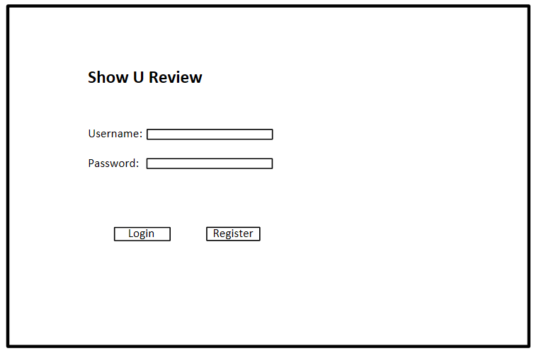
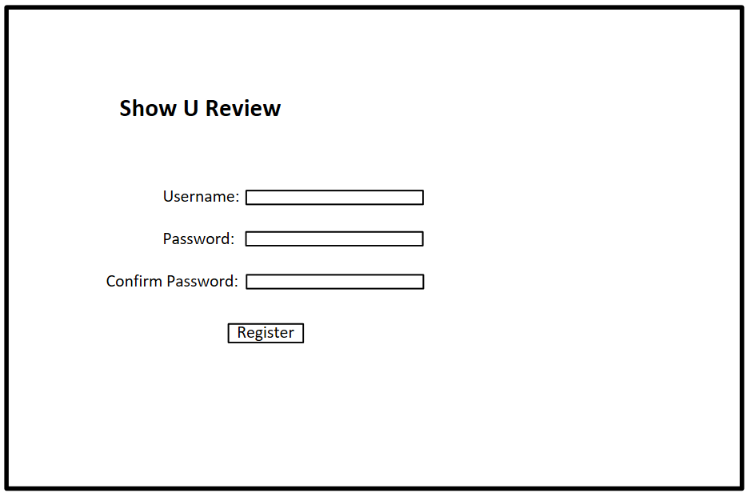
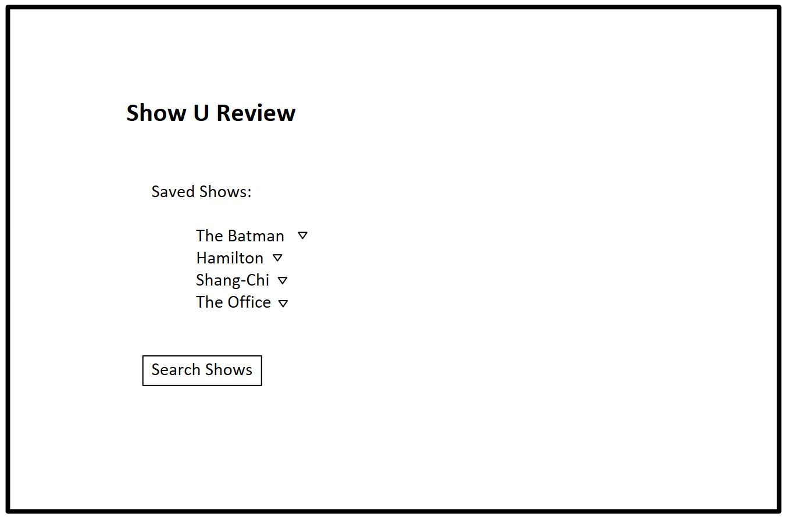
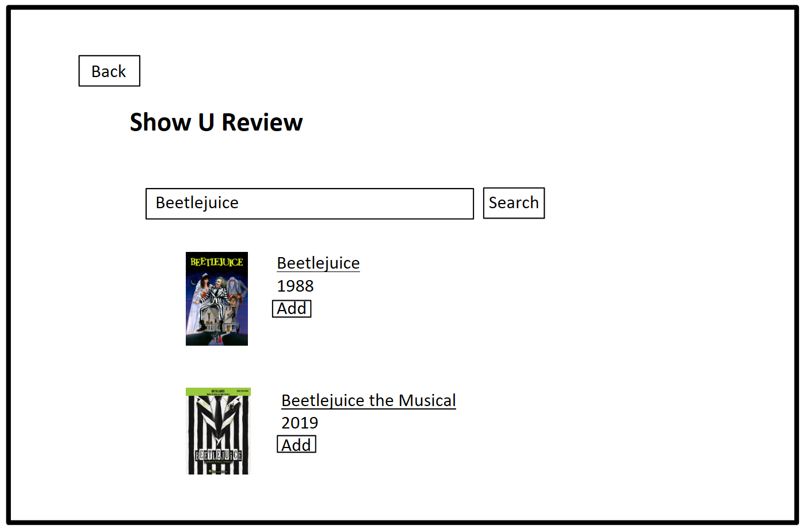
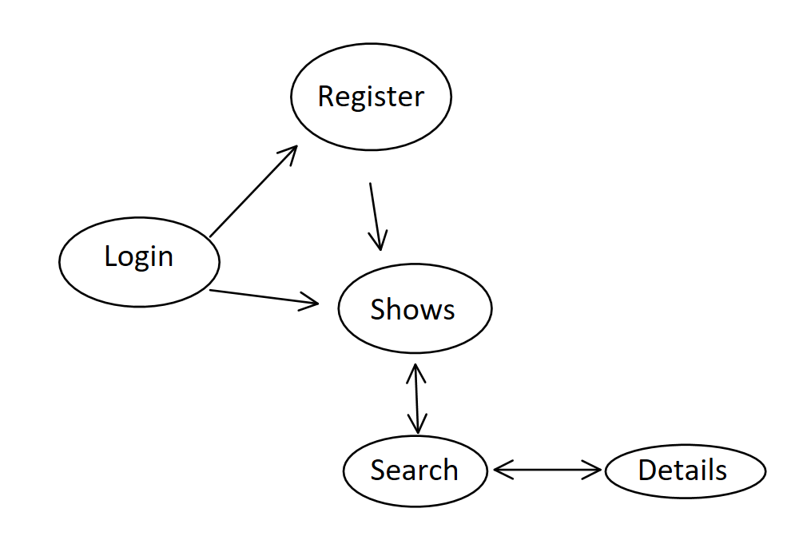

# Show U Review

## Overview

Everyone seeks entertainment from time to time. You have probably seen and loved many movies, TV series, or performances (i.e. Broadway shows), and want to talk about and share your experiences watching them. Maybe you want a way to keep track of all the shows you've watched and remember what you thought about them. Or perhaps you are deciding on what to watch next, and want to see what other people are saying about a show. 

Show U Review is a web app that lets users write and share their own thoughts and experiences about a show. Users can register and login, can search for shows, and can look at other peoples' reviews for the show. Users can also write their own comments and reviews for a show, mark which shows they have watched, and can add new shows to talk about. 

## Data Model

The application will store Users, Shows, and Reviews

* users can have multiple shows watched/saved (referencing)
* users can have multiple notes for shows (embedding)
* users can have public reviews for shows (referencing)
* shows can have multiple reviews from different users (referencing)


An Example User:

```javascript
{
  username: "some guy",
  hash: // a password hash,
  shows: // array of references to Shows
  notes: [
    { show: "The Batman", watched: True, comment: "This is better than I thought!"},
    { show: "Hamilton", watched: True, comment: "I don't usually watch musicals, but the songs are so catchy!"}
  ]
  reviews: // array of references to Reviews
}
```

An Example Show:

```javascript
{
  name: "The Batman",
  year: 2022, // Either just the year or the date it came out
  reviews: // array of references to comments
}
```

An Example Review:

```javascript
{
  user: "some guy",
  show: "The Batman",
  created: // timestamp,
  rating: 8,
  comment: "This is a decent reboot. Will recommend if you are a fan of the franchise."
}
```


## [Link to Commented First Draft Schema](db.js) 

## Wireframes

/login - page to log in


/register - page to create account


/shows - page to show all saved shows and notes


/shows/search - page to look up shows


/shows/search - page to dispay show details


## Site map


## User Stories or Use Cases

1. as non-registered user, I can register a new account with the site
2. as a user, I can log in to the site
3. as a user, I can search for shows
4. as a user, I can save a show to my list
5. as a user, I can add personal notes to a show
6. as a user, I can write a review for a show

## Research Topics

* (3 point) Deploy to Heroku

* (1 point) Use MongoDB Atlas to host database

* (2 points) Use some sort of linter
    * Probably ESLint

* (2 points) Use a CSS framework or a CSS preprocessor, haven't decided
    * Framework: either tailwind.css or Bootstrap.
    * Preprocessor: Sass.

* (3 points) Use grunt
    * automate linting
    * automate Sass (if I decide to use it)

* (4 points) Planning to use react.js for frontend
    * Probably not as difficult as vue, but will still be a major portion of the project.

Possible 13 points total out of 8 required points 

## [Link to Initial Main Project File](app.js) 

## Annotations / References Used

Research on deploying on heroku:
https://devcenter.heroku.com/articles/deploying-nodejs

Research on using MongoDB Atlas with Heroku: https://www.mongodb.com/developer/how-to/use-atlas-on-heroku/